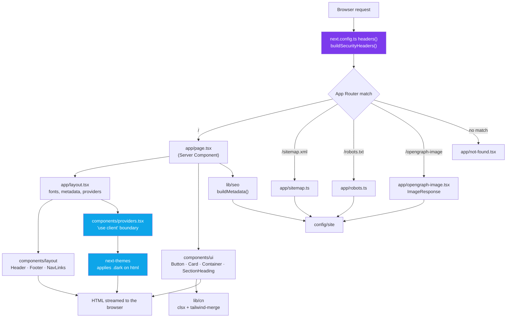
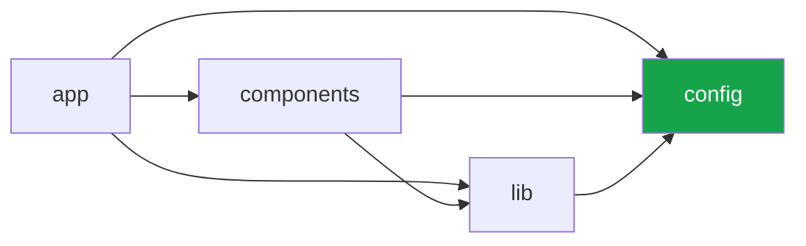

# Architecture Overview

The template is a small, deliberately flat Next.js application. There is no service layer, no
dependency injection container and no state management library — because a site, blog or landing page
does not need them, and adding one later is easier than removing one now.

What *is* enforced is the direction of dependencies and the boundary between server and client.

## Request flow

Blue nodes are the only parts of the tree that execute in the browser. Everything else renders on
the server and arrives as HTML.

---

## The layers

### `app/` — routing and composition

The App Router owns URLs, metadata and the document shell. Route files compose components; they do
not contain business logic and they do not contain markup you would want to reuse. If a chunk of JSX
appears twice, it belongs in `components/`.

`layout.tsx` is where the global concerns live: the `<html>` element and its `lang`, the font
variable class, `<Providers>`, the header and footer, and the Vercel analytics scripts.

`robots.ts`, `sitemap.ts`, `icon.tsx`, `apple-icon.tsx` and `opengraph-image.tsx` are *file
conventions*, not ordinary routes: Next recognises them by name and generates the corresponding
asset at build time. They are covered in [SEO & Metadata](seo.md).

### `components/` — the view

Two folders, split by responsibility rather than by size:

`components/ui/`
: Presentational primitives with no knowledge of the site. `Button`, `Card`, `Container`,
`SectionHeading`, `ThemeToggle`. They take props, they render markup, they compose classes with
`cn()`. A primitive that reads `siteConfig` is no longer a primitive.

`components/layout/`
: Page furniture that *does* know about the site: `Header`, `Footer`, `NavLinks`. These read
`siteConfig` and are used by the root layout.

`components/providers.tsx`
: The single client boundary that wraps the tree. It exists so `layout.tsx` can stay a Server
Component while `next-themes` gets the client context it needs.

### `config/` — inputs

`config/site/`
: Static identity — name, description, canonical URL, navigation, social links. Plain data,
annotated with an explicit `SiteConfig` type so a missing or misspelled field is a compile error.

`config/environment/`
: The only place `process.env` is read. `environment.ts` parses and validates the variables into a
typed object; `app-env.ts` defines the `AppEnv` union and its guard. Everything else imports the
typed object, so a missing or malformed variable is one failure in one place instead of a
`string | undefined` leaking through the codebase.

### `lib/` — pure functions

No React and no side effects at module scope. `cn`, `seo`, `sanitize`, `security-headers`, `og`.
This is the layer that makes the rest testable: `buildSecurityHeaders()` returns an array of
`{ key, value }` objects, so it can be asserted directly without booting a server, and
`next.config.ts` can import it at config-evaluation time — `security-headers.ts` imports nothing at
all.

The other four modules are not import-free: `seo.ts` reads `siteConfig` and Next's `Metadata` type,
`og.ts` is consumed by the `ImageResponse` routes, and `cn.ts` wraps `clsx` and `tailwind-merge`. The
constraint is "no React, no component, nothing that needs a DOM", not "no imports".

### `styles/`

One file. `globals.css` imports Tailwind, declares the dark variant, defines the `@theme` tokens and
a small base layer. See [Styling](styling.md).

---

## Dependency direction

Arrows point one way only, and `config/` is the sink: it imports nothing outside itself. `lib/` sits
above it (`seo.ts` reads `siteConfig`), and neither ever imports from `components/` or `app/`.
Nothing enforces this mechanically today — it is a review convention — but the barrel rule makes
violations obvious, because a wrong-direction import is visible at the top of the file as
`@/app/...`.

---

## RSC-first

**Every component is a Server Component until proven otherwise.** `'use client'` is a cost, and the
template treats it that way:

- A Server Component ships **zero** JavaScript for itself. Its output is HTML.
- `'use client'` marks the *entry point* of a client subtree. Every module it imports is pulled into
  the browser bundle too, transitively.
- Therefore the directive belongs on the **leaves** — the smallest component that genuinely needs
  interactivity — never on a layout or a page.

In this template exactly three files are client components:

| File | Why |
| --- | --- |
| `components/providers.tsx` | `next-themes` needs React context and `localStorage`. |
| `components/ui/theme-toggle.tsx` | Calls `useTheme()` and handles a click. |
| `app/error.tsx` | Next requires error boundaries to be client components. |

`app/layout.tsx` and `app/page.tsx` stay on the server, and the header — which *contains* the theme
toggle — stays on the server too, because a Server Component can render a Client Component as a
child. The reverse is what forces the boundary upward.

!!! tip "The test: does it need an event, a browser API, or a hook?"

    `onClick`, `useState`, `useEffect`, `window`, `localStorage` :material-arrow-right: client.
    Reading data, composing markup, formatting text :material-arrow-right: server. When in doubt,
    leave it on the server and let the compiler tell you.

---

## Where the framework does the work

A recurring theme: prefer the platform feature over a dependency.

| Concern | Handled by | Not by |
| --- | --- | --- |
| Fonts | `next/font` (self-hosted, no layout shift) | A `<link>` to a font CDN |
| Images | `next/image` with AVIF/WebP | A custom loader |
| Metadata | The `Metadata` API + `buildMetadata()` | `react-helmet` |
| Sitemap / robots | `sitemap.ts` / `robots.ts` | A generator script |
| Social images | `ImageResponse` | A design file checked into `public/` |
| Security headers | `next.config.ts` `headers()` | Middleware or a proxy config |
| Theme | `next-themes` + a CSS variant | A theme context of our own |

---

## Read next

- [Conventions](conventions.md) — the rules that keep this shape as the project grows.
- [Styling](styling.md) — tokens, dark mode, and why there are no `dark:` classes.
- [SEO & Metadata](seo.md) — `buildMetadata()`, canonical URLs, structured data.
- [Security](security.md) — the headers, the sanitisers, and the supply chain.
