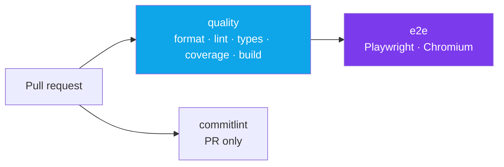

# CI/CD

Five workflows in `.github/workflows/`. Only the deploy pair needs configuration; the rest work on a
fresh clone with nothing set up.

| Workflow | Trigger | What it does |
| --- | --- | --- |
| `ci.yml` | pull request, push to `main`, manual | The quality gate: format, lint, types, unit tests + coverage, build, E2E, commit messages |
| `codeql.yml` | pull request, push to `main`, weekly schedule | GitHub's static security analysis for JavaScript/TypeScript |
| `deploy-preview.yml` | push to `main`, manual | Builds and deploys a Vercel preview, writing the URL to the job summary |
| `deploy-production.yml` | a GitHub release being published, manual | Builds and deploys to Vercel production |
| `publish-docs.yml` | push to `main` touching `docs/**`, `mkdocs.yml`, `README.md` or the workflow itself, manual | `mkdocs build --strict` and publish to GitHub Pages |

---

## `ci.yml` — the quality gate

Three jobs. Two of them run in parallel; `e2e` waits.



### Workflow-level settings

```yaml
concurrency:
  group: ci-${{ github.workflow }}-${{ github.ref }}
  cancel-in-progress: true

permissions:
  contents: read

env:
  NEXT_TELEMETRY_DISABLED: 1
  HUSKY: 0
```

`concurrency`
: One run per ref. Pushing a new commit to a pull request cancels the previous run instead of paying
for a build whose result is already obsolete.

`permissions: contents: read`
: Least privilege. This workflow only reads the repository. Jobs that need more — CodeQL's
`security-events: write`, the docs deploy's `pages: write` — declare it in their own file.

`HUSKY: 0`
: Disables the Git hooks. They are a local developer aid; CI runs the real checks directly, and a
hook firing inside a workflow would be redundant at best.

### Job: `quality`

Steps, in order — and the order is the point:

| # | Step | Notes |
| --- | --- | --- |
| 1 | Checkout | `persist-credentials: false` — the job never pushes, so the token should not be left in `.git/config` where a `postinstall` script could read it. |
| 2 | Setup Node | `node-version-file: .node-version` and `cache: npm`. One source of truth for the version; the npm cache is keyed on `package-lock.json`. |
| 3 | `npm ci` | Lockfile-exact install. |
| 4 | `npm run format:check` | ~1 second. |
| 5 | `npm run lint` | ~5 seconds. |
| 6 | `npm run typecheck` | ~5 seconds. |
| 7 | `npm run test:coverage` | Unit tests plus the 100% thresholds. |
| 8 | Upload coverage | `if: success() \|\| failure()` — the HTML report is *most* useful when a threshold failed. |
| 9 | Restore Next.js cache | `.next/cache`, keyed on the lockfile plus a source hash. |
| 10 | `npm run build` | The slowest step, so it runs last. |

> The steps below are ordered from cheapest to most expensive so a broken pull request fails in
> seconds instead of minutes.

That comment is in the workflow file, and it is the whole design: a missing semicolon should not cost
you a production build.

### Job: `e2e`

`needs: quality` — there is no point spending minutes on browsers if the code does not typecheck.

```yaml
- name: Resolve Playwright version
  id: playwright
  run: echo "version=$(node -p "require('@playwright/test/package.json').version")" >> "$GITHUB_OUTPUT"

- name: Restore Playwright browsers
  uses: actions/cache@v4
  with:
    path: ~/.cache/ms-playwright
    key: ${{ runner.os }}-playwright-${{ steps.playwright.outputs.version }}
```

The cache key is the **resolved** version read from the installed package, not the specifier in
`package.json`. Browser binaries are tied to the exact Playwright release; keying on a range would
restore browsers that the runner then refuses to use.

The job builds the app explicitly, because `playwright.config.ts` only starts `npm run start` when
`CI` is set — it deliberately does not rebuild what the workflow already built. On failure,
`playwright-report/` is uploaded as an artifact.

### Job: `commitlint`

Runs on pull requests only — commits on `main` were already validated before the merge.

```yaml
- uses: actions/checkout@v4
  with:
    fetch-depth: 0        # commitlint walks the base..head range
    persist-credentials: false

- name: Validate commit messages
  env:
    BASE_SHA: ${{ github.event.pull_request.base.sha }}
    HEAD_SHA: ${{ github.event.pull_request.head.sha }}
  run: npx commitlint --from "$BASE_SHA" --to "$HEAD_SHA" --verbose
```

The SHAs go through `env:` rather than being interpolated directly into `run:`. That is the standard
defence against script injection on `pull_request` triggers, where parts of the event payload are
attacker-controlled. It costs three lines and closes the vector permanently.

---

## `codeql.yml`

GitHub's static analysis, run on pull requests, on pushes to `main`, and on a weekly schedule. The
schedule matters: CodeQL's rule set improves over time, so code that was clean in January can produce
a finding in June without anyone touching it.

```yaml
permissions:
  contents: read
  security-events: write   # required to upload results
  actions: read
```

Findings land in the repository's **Security** tab, not in the pull request diff. For a template with
this little application logic, expect it to be quiet — which is the point. It is a tripwire, not a
linter.

!!! warning "Enable code scanning once, or this job fails"

    Code scanning is off by default on a fresh repository. The analysis itself still runs and
    succeeds; it is the **upload** of the results that fails, with
    `Code scanning is not enabled for this repository`. Every other job stays green, so it is easy to
    misread as a broken workflow.

    Fix it under **Settings :material-arrow-right: Code security :material-arrow-right: Code
    scanning**, choosing **Advanced**. This workflow *is* the advanced configuration — do not also
    enable the default setup, because the two conflict and GitHub will reject the upload.

    On a private repository this requires GitHub Advanced Security. Without it, delete
    `.github/workflows/codeql.yml`.

---

## The deploy workflows

`deploy-preview.yml` and `deploy-production.yml` both do `vercel pull` :material-arrow-right:
`vercel build` :material-arrow-right: `vercel deploy --prebuilt`, differing only in the environment
and the `--prod` flag.

Both require three repository secrets — `VERCEL_TOKEN`, `VERCEL_ORG_ID`, `VERCEL_PROJECT_ID` — and
both fail loudly without them. Full setup, including how to find the IDs, is in
[Deployment](deployment.md#required-secrets).

One difference worth knowing:

```yaml
# deploy-production.yml
concurrency:
  group: deploy-production
  cancel-in-progress: false
```

Production deploys are never cancelled mid-flight — interrupting a rollout is worse than completing
an obsolete one. Preview deploys do cancel, because a superseded preview is just wasted minutes.

---

## `publish-docs.yml`

Builds this site and publishes it to GitHub Pages.

```yaml
on:
  push:
    branches: [main]
    paths:
      - 'docs/**'
      - 'mkdocs.yml'
      - 'README.md'
      - '.github/workflows/publish-docs.yml'
  workflow_dispatch:

permissions:
  contents: read
  pages: write
  id-token: write   # OIDC token for the Pages deployment
```

The steps: set up Python, `pip install -r docs/requirements.txt`, `mkdocs build --strict`, upload
`site/` as a Pages artifact, deploy.

!!! danger "`--strict` turns every warning into an error"

    A link to a page that does not exist, a page missing from `nav:`, or a bad reference fails the
    build. Run `make docs-build` locally before pushing — it is the same command. See the
    [documentation guide](documentation.md).

One-time setup: Repository Settings :material-arrow-right: Pages :material-arrow-right: Source:
**GitHub Actions**. Without it the deploy step fails on its first run.

---

## Caching

| Cache | Key | Restored by |
| --- | --- | --- |
| npm | `package-lock.json` hash | `actions/setup-node` with `cache: npm` |
| Next.js build | lockfile hash + source hash, with `restore-keys` | `actions/cache` on `.next/cache` |
| Playwright browsers | resolved Playwright version | `actions/cache` on `~/.cache/ms-playwright` |
| pip (docs) | `docs/requirements.txt` hash | `actions/setup-python` with `cache: pip` |

The Next.js cache uses layered keys:

```yaml
key: ${{ runner.os }}-nextjs-${{ hashFiles('package-lock.json') }}-${{ hashFiles('src/**/*.ts', 'src/**/*.tsx', 'src/**/*.css', 'next.config.ts', 'postcss.config.mjs') }}
restore-keys: |
  ${{ runner.os }}-nextjs-${{ hashFiles('package-lock.json') }}-
  ${{ runner.os }}-nextjs-
```

An exact match reuses everything. A source change misses the exact key but still restores the most
recent cache for the same dependency set, so the build is incremental rather than cold. Keys are
immutable in GitHub Actions — a cache entry is never overwritten, which is why `restore-keys` exists.

!!! note "Playwright browsers are cached, the OS libraries are not"

    `npm run test:e2e:install` runs on every job even on a cache hit. The browser download is
    skipped; the `--with-deps` system packages are installed each time, because they live outside the
    cached directory.

---

## Dependabot

```yaml title=".github/dependabot.yml (shape)"
version: 2
updates:
  - package-ecosystem: npm
    directory: '/'
    schedule: { interval: weekly, day: monday }
    open-pull-requests-limit: 10
    commit-message: { prefix: 'chore(deps)', prefix-development: 'chore(deps-dev)' }
    groups:
      # Runtime dependencies ship to users, so they get their own pull request.
      production-dependencies: { dependency-type: production }
      development-dependencies: { dependency-type: development }
    ignore:
      # Framework and TypeScript majors are migrations, done by hand.
      - { dependency-name: next, update-types: [version-update:semver-major] }
      - { dependency-name: react, update-types: [version-update:semver-major] }
      - { dependency-name: react-dom, update-types: [version-update:semver-major] }
      - { dependency-name: typescript, update-types: [version-update:semver-major] }

  - package-ecosystem: github-actions
    directory: '/'
    schedule: { interval: weekly, day: monday }
    commit-message: { prefix: 'ci(deps)' }

  # Base images in Dockerfile / Dockerfile.dev.
  - package-ecosystem: docker
    directory: '/'
    schedule: { interval: weekly, day: monday }
```

Three ecosystems, all batched on Monday morning: npm, GitHub Actions and the Docker base images.
Each carries a Conventional Commit prefix so the `commitlint` job accepts the generated commits
without a human touching them.

Because every dependency is pinned exactly (`.npmrc` sets `save-exact=true`), Dependabot is the
*only* way a version changes. That is the trade: no silent drift, in exchange for a handful of pull
requests a week.

How to handle them:

1. Let CI run. The 100% coverage gate plus the E2E suite catches most breakage.
2. Read the changelog for majors, and for anything in the `next` / `react` family.
3. Merge dev-dependency updates freely; they do not ship.
4. Batch several with `@dependabot rebase` rather than merging one at a time.

Grouping development dependencies keeps the volume manageable — one pull request for the whole
toolchain instead of eleven.

---

## Reading a failure

Start with the job name; each one fails for a distinct reason.

??? failure "`quality` → Check formatting"

    Prettier disagrees with a committed file. Fix: `make format`, then commit. If this fails on a
    file you never touched, someone committed with `--no-verify`.

??? failure "`quality` → Lint"

    Read the rule name in the output.

    - `no-restricted-imports` → you imported an internal file instead of the barrel. See
      [Conventions](../architecture/conventions.md#barrel-imports).
    - `@typescript-eslint/no-unused-vars` → dead code, or a parameter that should be prefixed `_`.
    - `react-hooks/*` → a hook called conditionally, or a missing dependency.

    `make lint-fix` handles the auto-fixable subset.

??? failure "`quality` → Typecheck"

    `tsc` output points at the file and line. The two that surprise people:

    - `Object is possibly 'undefined'` on `array[0]` — that is `noUncheckedIndexedAccess` doing its
      job. Guard it.
    - Errors in `.next/types/**` — stale generated types. `rm -rf .next` and rebuild.

??? failure "`quality` → Unit tests with coverage"

    Two different failures share this step.

    **A test failed.** The assertion is in the log.

    **A threshold failed** — `ERROR: Coverage for branches (98.4%) does not meet threshold (100%)`.
    Download the `coverage-report` artifact from the run summary, open `index.html`, and look for
    red lines and yellow branch markers. Uncovered branches are usually the else side of a
    conditional or a default parameter value.

??? failure "`quality` → Build"

    Everything else passed, so this is a build-time-only problem:

    - A Server Component using a browser API, or a hook without `'use client'`.
    - A missing `NEXT_PUBLIC_*` variable that some code assumes is present.
    - A dynamic import that cannot be resolved statically.

??? failure "`e2e` → Run end-to-end tests"

    Download the `playwright-report` artifact and run `npx playwright show-report`. With
    `trace: 'on-first-retry'`, a failing test has a full trace: DOM snapshots per step, network,
    console.

    Reproduce locally with `npx playwright test --ui`. If it passes locally but fails on CI, suspect
    a timing assumption — CI runners are slower. Use Playwright's auto-waiting locators
    (`expect(locator).toBeVisible()`) rather than a fixed `waitForTimeout`.

??? failure "`commitlint` → Validate commit messages"

    The output names the offending commit and the rule. Fix the history and force-push:

    ```bash
    git rebase -i origin/main   # reword the offending commits
    git push --force-with-lease
    ```

    Use `--force-with-lease`, never plain `--force`.

??? failure "`deploy-*` → any step"

    Almost always missing or expired secrets. Check `VERCEL_TOKEN` (they expire),
    `VERCEL_ORG_ID` and `VERCEL_PROJECT_ID`. `Error: Project not found` means the project ID does not
    match the token's scope.

??? failure "`publish-docs` → mkdocs build"

    `--strict` promoted a warning to an error. The two common ones:

    - `Doc file 'x.md' contains a link 'y.md', but the target is not found` — a broken internal link.
    - A page exists but is not in `nav:`.

    Reproduce with `make docs-build`.

---

## Branch protection

Once CI is green on `main`, lock it down. Settings :material-arrow-right: Branches
:material-arrow-right: Add rule for `main`:

- [x] Require a pull request before merging.
- [x] Require status checks to pass: **Quality (format, lint, types, unit tests, build)**,
      **End-to-end tests (Playwright)**, **Conventional Commits**.
- [x] Require branches to be up to date before merging.
- [x] Require conversation resolution before merging.
- [x] Do not allow bypassing the above settings.

Status check names come from the job's `name:` field, so add them after the first successful run —
GitHub only offers checks it has seen.
