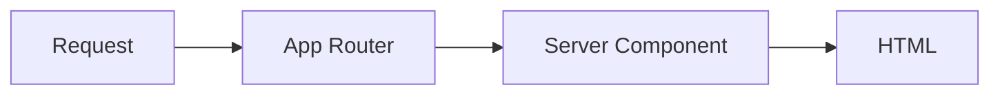

# Documentation

This site is built with [MkDocs](https://www.mkdocs.org) and the
[Material](https://squidfunk.github.io/mkdocs-material/) theme, from Markdown files in `docs/`. It is
published to GitHub Pages by `.github/workflows/publish-docs.yml`.

## Previewing locally

```bash
make docs
```

Serves the site at <http://localhost:8000> with live reload — save a Markdown file and the browser
updates. The target runs the pinned `squidfunk/mkdocs-material:9.7.7` image with the repository bind
-mounted at `/docs`, so **Docker is the only requirement**: no Python, no virtualenv, and nothing
installed on your machine. Override the port with `make docs DOCS_PORT=8080`.

```bash
make docs-build
```

Runs `mkdocs build --strict` in the same image — **the exact command CI runs**. It writes the static
site to `site/` (git-ignored) and, more usefully, fails on anything the strict build would reject.
Run it before pushing documentation changes.

The equivalent without `make`, if you would rather install the toolchain locally:

```bash
python3 -m venv .venv
source .venv/bin/activate
pip install -r docs/requirements.txt

mkdocs serve          # preview
mkdocs build --strict # verify
```

That is what `publish-docs.yml` does in CI. Keep the pins in `docs/requirements.txt` in sync with
`MKDOCS_IMAGE` in the `Makefile`, or the local preview and the published site can diverge.

!!! note "Why `docs/requirements.txt` is not a page"

    It lives in `docs/` because `publish-docs.yml` installs it with
    `pip install -r docs/requirements.txt` and caches on that path. `mkdocs.yml` excludes it from the
    build:

    ```yaml
    exclude_docs: |
      requirements.txt
    ```

---

## Adding a page

Two steps. Skipping the second one breaks the build.

### 1. Create the file

```bash
touch docs/guides/analytics.md
```

Start with a single `#` heading — Material uses it as the page title in the sidebar and the browser
tab.

### 2. Add it to `nav:`

```yaml title="mkdocs.yml"
nav:
  - Guides:
      - Development: guides/development.md
      - Testing: guides/testing.md
      - Analytics: guides/analytics.md # ← new
```

!!! danger "The build runs with `--strict`"

    In strict mode every warning is an error. Two of them will bite you:

    - **A link to a page that does not exist.** `[testing](testing.md)` when the file is
      `guides/testing.md` fails the build rather than producing a dead link.
    - **A page outside `nav:`.** It is unreachable through navigation, which is almost always a
      mistake.

    `make docs-build` catches both in about two seconds. CI catches them in two minutes.

### Linking between pages

Use **relative paths including the `.md` extension**. MkDocs rewrites them to the right URLs.

```markdown
[Testing](testing.md)                        <!-- same folder -->
[Conventions](../architecture/conventions.md) <!-- sibling folder -->
[Home](../index.md)                          <!-- up a level -->
[Vercel](https://vercel.com)                 <!-- external, left alone -->
```

Do not link to repository files with a relative path — `../../src/lib/cn.ts` is not part of the
documentation tree and strict mode rejects it. Use an absolute GitHub URL when you must:

```markdown
[the MIT License](https://github.com/mauricioromagnollo/template-nextjs/blob/main/LICENSE)
```

---

## Writing conventions

### Admonitions

```markdown
!!! note "Optional custom title"

    Indented four spaces. Context a reader can skip.

!!! tip

    A shortcut or a better way.

!!! warning

    Something that will bite them.

!!! danger

    Something that will bite them badly — data loss, a security hole, a broken deploy.

??? question "Collapsed by default"

    Use `???` for FAQ entries and troubleshooting, so the page stays scannable.
```

Use them sparingly. A page where every third paragraph is an admonition has no emphasis at all.

### Code blocks

Always tag the language, and add a `title` when the snippet comes from a real file:

````markdown
```ts title="src/lib/cn.ts"
export function cn(...inputs: ClassValue[]): string {
  return twMerge(clsx(inputs))
}
```
````

Annotations attach explanations to a specific line:

````markdown
```ts
output: 'standalone', // (1)!
```

1.  Emits a self-contained server bundle under `.next/standalone`.
````

Tabs group alternatives:

````markdown
=== "npm"

    ```bash
    npm run dev
    ```

=== "make"

    ```bash
    make dev
    ```
````

### Diagrams

Mermaid is rendered natively — no external script, which matters because the docs site has the same
strict CSP philosophy as the app:

````markdown

````

### Style

- **Second person.** "Run `make check`", not "the developer should run".
- **Say why.** Anyone can read the config file to learn *what* it says. Documentation earns its
  keep by explaining the reason.
- **Be honest about trade-offs.** Every non-obvious decision has a cost; write it down.
- **Short paragraphs, tables over prose** when comparing more than two things.
- **Wrap at 100 columns**, matching the Prettier setting used for code.
- **English**, like the rest of the repository.
- Prettier does **not** format `docs/` (it is in `.prettierignore`), so formatting is on you.

---

## Writing an ADR

An architecture decision record captures a decision that was not obvious, at the moment it was made,
with the reasoning intact. Six months later, "why is this like this?" has an answer that is not
someone's memory.

### When to write one

Write an ADR when the decision:

- is expensive to reverse (a framework, a data format, a deployment target);
- constrains future work (a lint rule everyone must follow, a coverage floor);
- was chosen over a reasonable alternative and a newcomer would ask why;
- is one you have already explained twice in code review.

Do **not** write one for a fact, a preference with no consequence, or something a comment covers.
`docs/decisions/` should stay short enough to read in one sitting.

### How

1. **Copy the template**:

   ```bash
   cp docs/decisions/template.md docs/decisions/0005-my-decision.md
   ```

2. **Number it sequentially**, four digits, kebab-case title. Numbers are never reused, even when an
   ADR is superseded.

3. **Fill in the four sections** — Status, Context, Decision, Consequences. Keep Context free of the
   decision itself; it should read as a fair statement of the problem, one that would be recognisable
   to someone who chose differently.

4. **Be honest in Consequences.** The negative list is the part future readers actually need. An ADR
   with no downsides listed is marketing.

5. **Add it to `nav:` in `mkdocs.yml`** and to the table in
   [`docs/decisions/index.md`](../decisions/index.md).

6. **Commit with the `docs` type**:

   ```bash
   git commit -m "docs(decisions): record the analytics provider decision"
   ```

### Changing an existing ADR

Do not rewrite history. Set the old record's status to `Superseded by ADR-000X`, leave its content
intact, and write the new one — including what changed since the original was written. The value of
the archive is that it shows how thinking evolved.

---

## Updating the toolchain

MkDocs and its plugins are pinned like every other dependency:

```text title="docs/requirements.txt"
mkdocs-material==9.7.7
pymdown-extensions==11.0.1
```

To upgrade: bump the version, run `make docs-build` locally, confirm the strict build still passes,
and commit the change on its own so a regression is easy to bisect.
